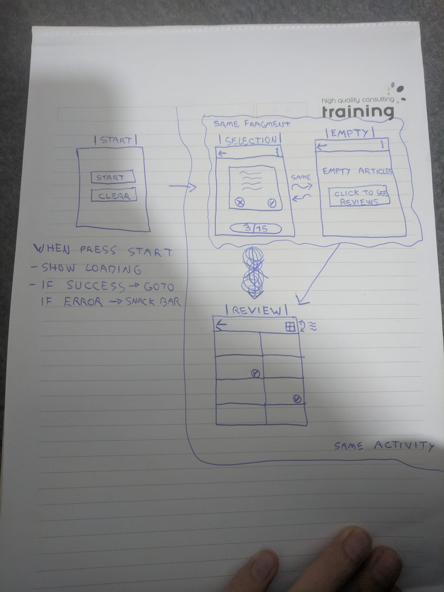
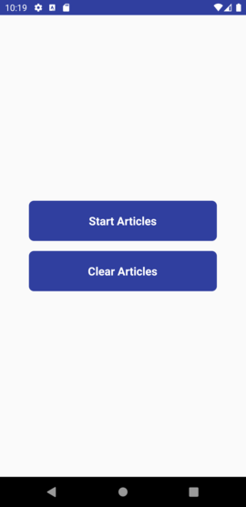

# About
The application will use Home24 public API to load several articles from remote server and
present them to the user one by one. User should mark the article as “liked” or ”disliked”
before another article will be presented. User will have a possibility to review his choices by
pressing the relevant button.

# Project structure
Explore the project master branch and packages to see how it works. The project architecture is MVVM/MVI with Clean Architecture using SOLID concepts.

### Overview
The `app` module is the main entry.
The total amount of article should be easily configurable from gradle buildConfigField called NUM_ARTICLES.)

# Planning

# UI
  

### Features organization

I have organized my code by feature. This avoid to share knowledge between feature without is required.

- **Start Screen**
  * Go to SelectionScreen
  * Clear Database Room
- **Selection Screen**
  * Show articles not already reviewed 
  * Set as reviewed (isReview)
  * Set as favorite or not favorite (isFavorite)
  * Verify if all articles are isReview
  * Number of article isLike
  * Total number of articles
  * Go to ReviewScreen
- **Review Screen**
  * Show all articles
  * All articles should be isReview
  * Verify if article isFavorite or not
  * Switch between gridLayout with 1 or 2 columns

# WARNING

- Integration tests work only API 26 or greater.
- Disabled animation.